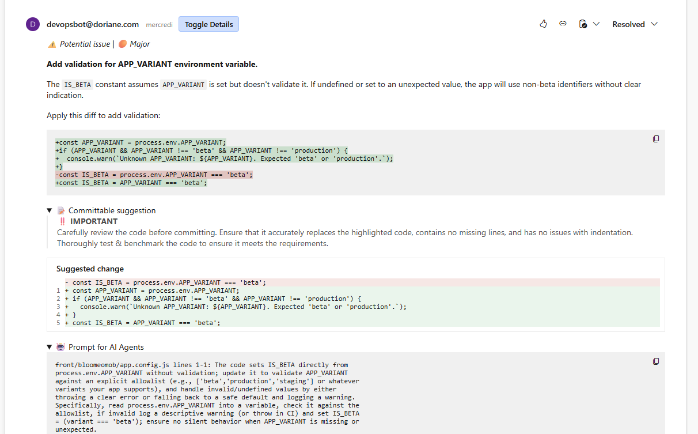

A special thanks to [@Yohann](https://github.com/YohannTognetti) for the base of the script (toggle button for CodeRabbit)

This Tampermonkey script is used in my job at [Doriane](https://www.doriane.com/) to make my pull request reviews easier.

# DevOps PR Helpers Tampermonkey Script

Enhance your Azure DevOps Pull Request (PR) experience with this Tampermonkey script. It adds two key features:

1. **Toggle Details** for comments made by `CodeRabbit`.
2. **Quick-insert buttons** for commonly used comment phrases.

---

## Features

### 1. Toggle Details

- Adds a **“Toggle Details”** button next to DevOpsBot comments.
- Clicking the button expands or collapses all `<details>` elements in the comment.

### 2. Quick-insert Buttons

- Adds customizable **insert buttons** next to all PR comment text areas.
- Text is inserted at the current cursor position in the comment box.

---

## Installation

1. Install [Tampermonkey](https://www.tampermonkey.net/) in your browser.
2. Create a new userscript.
3. Copy the contents of `DevOps PR Helpers.user.js` and paste it into the Tampermonkey editor.
4. Save the script.
5. Open an Azure DevOps PR page — the script will automatically activate.

---

## Customization

- You can **add or modify buttons** by editing the `buttons` array in the script:

```javascript
const buttons = [
  { name: "My Button", value: "Custom text to insert" },
  // add more here
];
```

## Screenshots



